## 1. Information

On this **ChocolateFire** machine we will practice a realistic web pentesting and post-exploitation flow focused on **Openfire**.  
The goal is to go through all stages: network and service reconnaissance, web enumeration, credential brute-force, admin panel bypass/exploitation, and finally the use of frameworks to facilitate exploitation.

---

## 2. Reconnaissance with nmap

Once the machine Docker container is deployed, we perform reconnaissance with `nmap`. First, we can check connectivity with `ping` if needed, and then run a full scan:

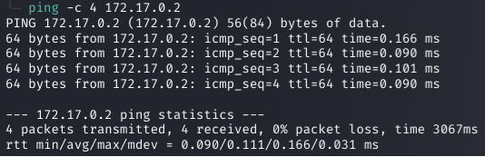


```bash
sudo nmap -sS -sV -Pn -T4 -p- --open -oA chocolatefire 172.17.0.2
```
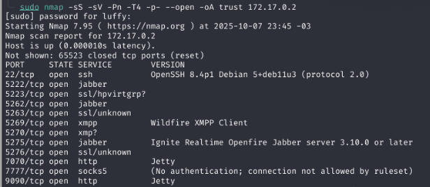

The output shows a service running on port **9090**, so we proceed to investigate that service (web admin panel).

---

## 3. Web Fingerprinting (Web Reconnaissance)

We open the panel in the browser and find an **Openfire login panel** (version `4.7.4`). 

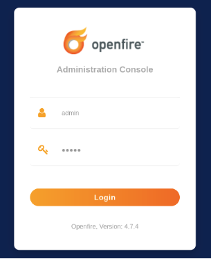


With the identified version we can:

- Search for public exploits or PoCs.  
- Try known default credentials for that version.

> **Note 1:** Openfire is an XMPP (Jabber) messaging server.  
> **Note 2:** In this write-up we follow two vectors: default credential checks and exploitation via CVE.

As shown on the interface, the detected default credentials are `admin:admin`. We try those first and, in parallel, prepare the exploit path.

### Exploits / references
- CVE-2023-32315 (exploitation affecting certain Openfire versions).  
  Repositories with PoC / exploit:  
  - https://github.com/miko550/CVE-2023-32315#  
  - https://github.com/K3ysTr0K3R/CVE-2023-32315-EXPLOIT

(The linked repositories contain exploit variants — we can refer to them as *Exploit A* and *Exploit B* depending on source and method.)

Exploit A

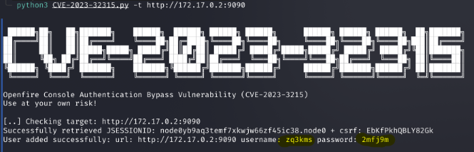


Exploit B

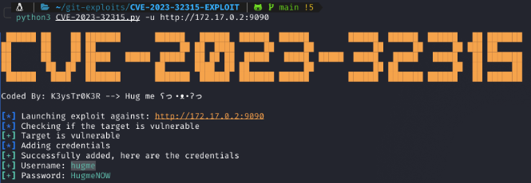


---

## 4. Initial access and brute force with Hydra

After enumerating users from the panel or via enumeration techniques, we try SSH access for some of the first identified users. If the default credential is not sufficient or we want to test other accounts, we use `hydra` for SSH brute-force.

Example (attack against user `chocatitochingon`):

```bash
hydra -l chocatitochingon -P /usr/share/wordlists/rockyou.txt 172.17.0.2 ssh -t 4
```

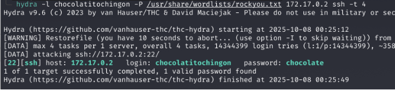


(Adapt the command to the username and wordlist you want to use.)

Once we obtain valid credentials, we connect via SSH:

```bash
ssh chocatitochingon@172.17.0.2
```

---

## 5. Privilege escalation (two approaches)

This machine shows **two paths** to escalate privileges. First we’ll cover the "more difficult" method (to practice shell usage and enumeration), and then a faster method using frameworks (e.g., Metasploit).

### 5.1. Escalation by abusing a binary (`dpkg`) — pivoting between users

After connecting via SSH with the obtained user, we perform typical **local enumeration** (`ls`, `id`, `sudo -l`, checking /home files, etc.). We observe two users with home directories; one of them is `pinguinacio`.

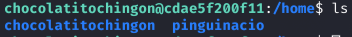


Checking permissions and `sudo -l`, we see that `pinguinacio` can execute a binary or command that allows escaping to a shell (in this case `/usr/bin/dpkg` or similar behavior). This allows us to pivot from `chocatitochingon` to `pinguinacio` by executing the binary in a controlled way.

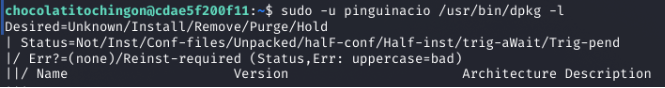


Illustrative interaction:

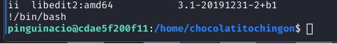


```text
# We run dpkg (or the indicated binary)
$ /usr/bin/dpkg
# A help menu / prompt appears; we escape with:
!/bin/bash
# This gives us a shell in the context of pinguinacio
```

Now acting as `pinguinacio`, we continue enumeration and look for escalation vectors.

Listing the directory we find a `script.sh` that `pinguinacio` can read:

```bash
ls -la
cat script.sh
```

We check `sudo -l` again for `pinguinacio` and discover that they can execute `script.sh` as root:

```bash
sudo -l
# shows: (root) NOPASSWD: /path/to/script.sh
```

#### Vulnerability in the script

The vulnerability in the script is that the shell performs **command expansion** (`$(...)`) when evaluating an input (`read`), and that expansion happens before the conditional check. Although the arithmetic comparison may quote `"$numero"`, the substitution `$(/bin/sh)` occurs during shell expansion and therefore executes with the privileges of the parent process (which are **root** when the script is run via `sudo`).

- **Summary:** unvalidated input + script executed as root → possibility to execute `$(...)` as root.


> Reference on the technique: https://exploit-notes.hdks.org/exploit/linux/privilege-escalation/bash-eq/

With this, we can inject an expansion that spawns a root shell, for example:

```text
# (hypothetical) by providing input that triggers the expansion:
$(/bin/sh)
# and obtain a root shell
```

> **Warning:** the above example illustrates the mechanism; in a real environment always validate context and never run this against systems without authorization.

### 5.2. "Very easy" method — using Metasploit

As a quick alternative for practice purposes, you can use Metasploit or tools that automate exploitation of the vulnerability to obtain a privileged session faster. This is useful for learning or to compare both methodologies (manual vs. framework).

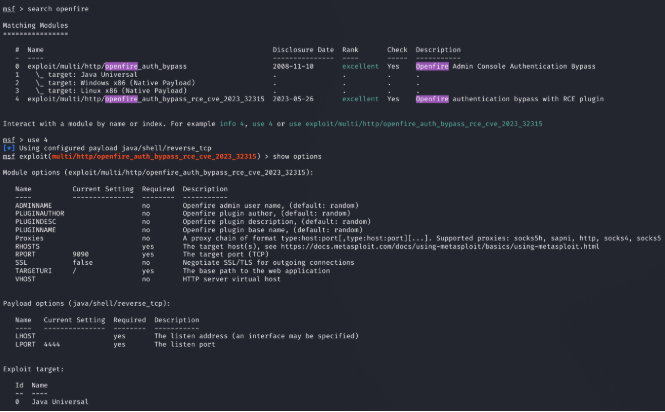
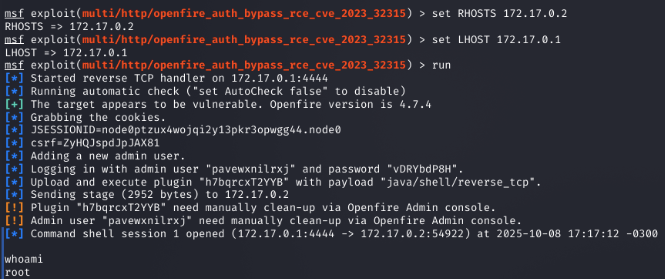


---

## 6. Conclusion

Using the steps above we compromised the **ChocolateFire** machine: first accessing the Openfire panel (default creds / exploit), then obtaining a remote account (SSH) and finally escalating privileges by abusing a script run as root and/or a privileged binary that allows pivoting to a more privileged user.

As shown, there are multiple ways to escalate privileges: from manual analysis and exploitation (recommended for learning and understanding) to using frameworks that speed up the process. Practicing both approaches strengthens the ability to identify vectors and propose mitigations.

---

## Resources and links

- CVE / Openfire exploits:  
  - https://github.com/miko550/CVE-2023-32315#  
  - https://github.com/K3ysTr0K3R/CVE-2023-32315-EXPLOIT

- Shell expansion technique in `read` / `bash -eq`:  
  - https://exploit-notes.hdks.org/exploit/linux/privilege-escalation/bash-eq/
