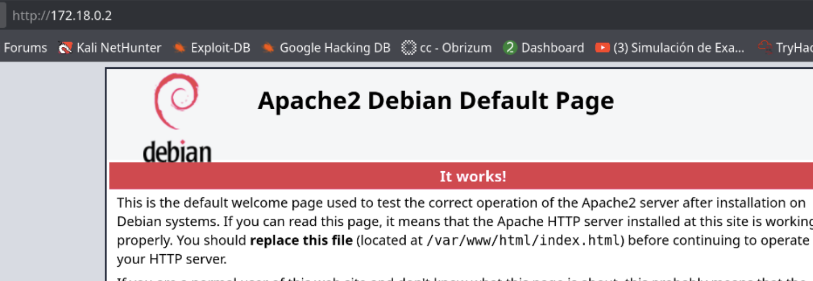
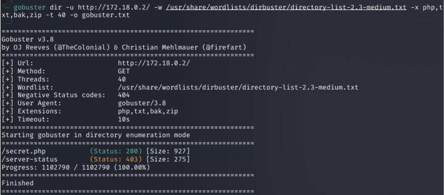
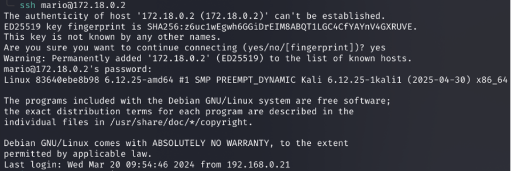
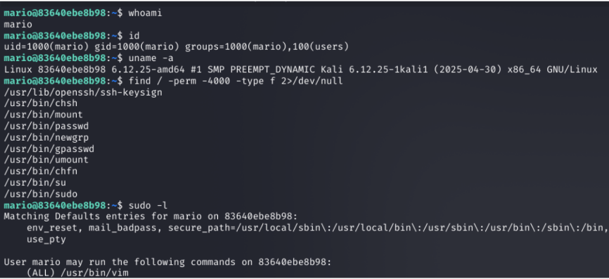

## Information

The Trust machine lets you practice service reconnaissance, directory fuzzing, brute-force attacks with Hydra, and privilege escalation by abusing binaries with elevated permissions (in this case, vim).

## Reconnaissance with nmap

Once the machine's Docker container is deployed, we perform reconnaissance with nmap, but first we ping to verify connectivity with the victim machine.

```bash 
ping -c 4 172.18.0.2
```


```bash
sudo nmap -sS -sV -Pn -T4 -p- --open -oA trust 172.18.0.2
```


As we can see, we have two open ports: 22 (ssh) and 80 where Apache is running — a sign of a web page.

## Web Fingerprinting (Web Reconnaissance)

We start web reconnaissance by opening the page in our browser to see what we find:



There's nothing interesting at first glance, but we should keep in mind that other pages may be hosted inside /var/www/html/, so we need to perform directory fuzzing.

```bash 
gobuster dir -u http://172.18.0.2/ -w /usr/share/wordlists/dirbuster/directory-list-2.3-medium.txt -x php,txt,zip,bak,sql -t 40 -o gobuster.txt
```


This finds a directory called “secret.php”, which we will investigate.

Once we open the page, we only see this:


We already have at least one clue: a possible username we can use!!

## Brute force with Hydra and privilege escalation

As we saw earlier, we found a name that could be a username: Mario. Keep in mind it might be Mario or mario, so using this clue we perform a brute-force attack with Hydra.

```bash
hydra -l mario -P /usr/share/wordlists/rockyou.txt 172.18.0.2 ssh -t 4
```


Once the attack finishes, we discover the password. Next, let's see if we can take control of the machine.

We connect to the machine.

```bash
ssh mario@172.18.02
```



Once connected, we begin internal enumeration.



During this enumeration, we find that the user mario can use vim as root. With this binary we can escalate privileges — first we go to a page called GTFOBins and look up the vim binary.

Note: GTFOBins is a community repository (web + GitHub) that lists UNIX binaries that can be abused to escape restrictions, execute commands with elevated privileges, read/write files, establish network connections, etc.
Each entry shows categorized techniques (for example: how to use the binary if it's SUID, if you can run it with sudo, if it allows writing files, opening shells, executing remote commands, etc.).

https://gtfobins.github.io/gtfobins/vim/


We enter vim, and we can find how to escalate privileges; in this example we do it with sudo.


```bash
sudo /usr/bin/vim -c ':!bash -i'
```


With that, we finish the resolution of the DockerLabs “Trust” machine.
