## Information

In this machine, “Domain”, we are going to practice a realistic flow of web pentesting and post-exploitation focused on Samba.  
The goal is to go through all stages: network and service reconnaissance, web enumeration, credential brute-force, Samba bypass/exploitation, and finally file upload abuse and privilege escalation through a binary with SUID enabled.

## Reconnaissance with nmap

Once the Docker instance is deployed, we start by scanning the target with nmap.  
Before that, we send a simple ping to verify connectivity with the victim machine.

```bash
sudo nmap -sS -sV -Pn -T4 -p- --open -oA domain 172.17.0.2
```

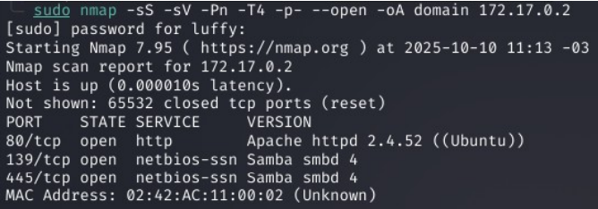

We see that three services are running, including port 80.  
So we proceed to investigate whether it hosts a web page.

## Web Fingerprinting (Web Recon)

We start with a basic web reconnaissance by opening the page in our browser to see what we find:


We are greeted by the default Apache page.  
Next, we perform directory fuzzing to see what else we can discover.


We only find an `index.html`, so let's inspect it.

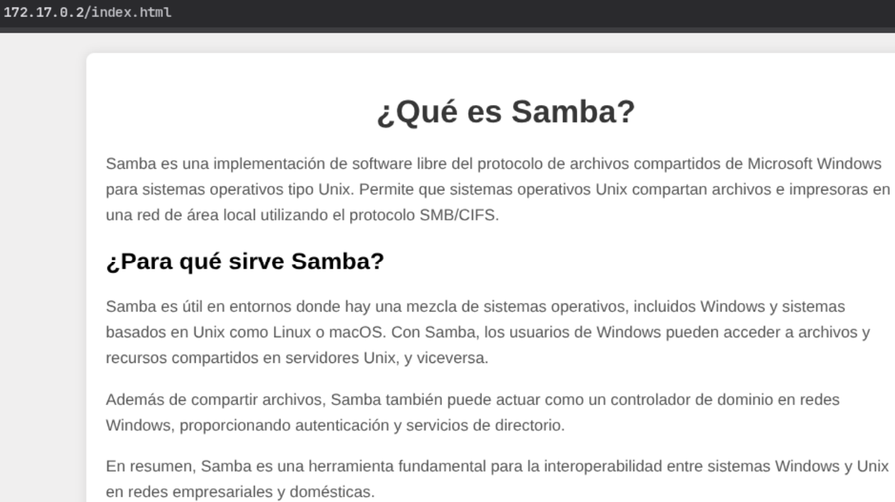

There’s nothing interesting on this page, so we move on to analyzing ports **139** and **445**.

---

### SMB Auditing and Reverse Shell

In this stage, we can use tools like **nxc**, **enum4linux**, and **smbclient**.  
First, we test with nxc. If Samba is misconfigured, it allows null sessions and lists shares and users; otherwise, it will fail.

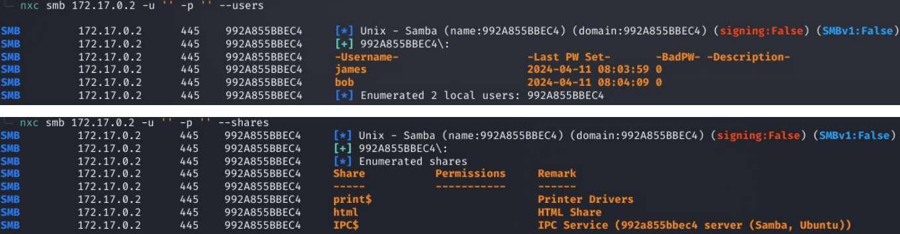

We found two users. Now let's try connecting with smbclient.


As expected, it asks for a password.  
We proceed by running a dictionary brute-force attack using nxc.


We successfully found Bob’s password.  
Now we reconnect to the `html` share.


We can see that only `index.html` exists—the same one discovered via gobuster.  
Next, let's test whether we can upload a `test.php`.  
If the upload works *and* it executes, then Apache is interpreting PHP.

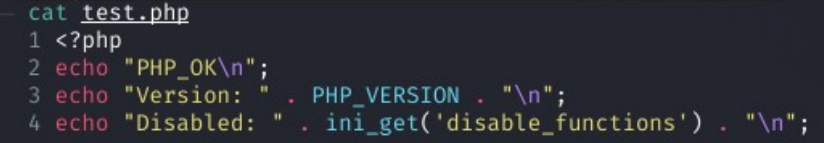


**NOTE:** Sometimes `.php` is NOT mapped, but `.phtml` is (Apache config).  
So we create the same file but with a `.phtml` extension.

We verify our uploaded file:


---

Once confirmed, we upload a reverse shell.  
We use https://www.revshells.com/, a reverse shell generator.

We select our attacker IP, the listening port, choose PHP, and pick the always reliable “PentestMonkey”.

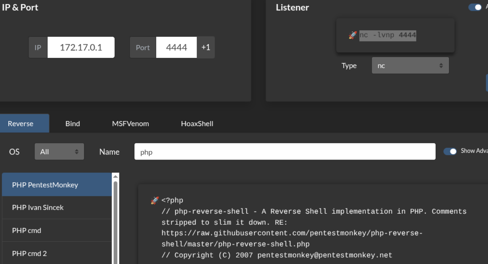

We copy the generated shell into a `.php` file and upload it the same way we did with `test.php`.

Then we start a listener so that when we access `/reverse.php`, we establish a connection and gain control of the victim machine.

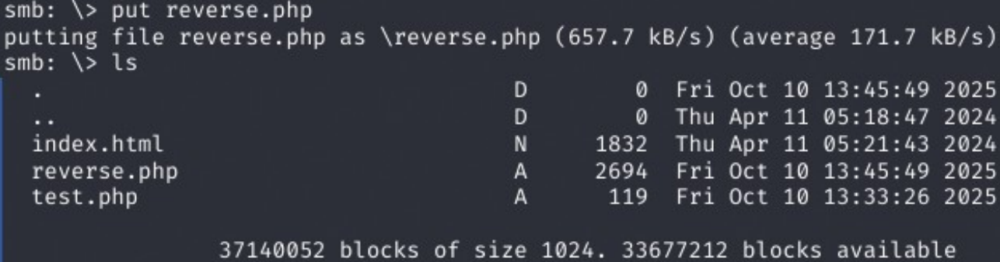

We visit the page → 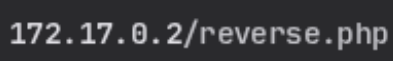

And on our listener, we receive the reverse shell.

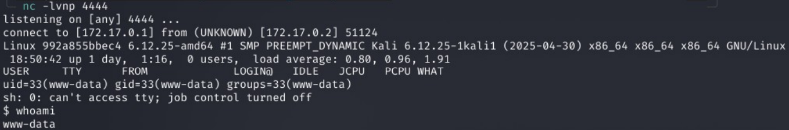

---

## Privilege Escalation

We begin by stabilizing our reverse shell:


Once stabilized, we perform the usual post-exploitation information gathering.


We discover that the **nano** binary has the SUID bit enabled.  
Therefore, we can use:  
https://gtfobins.github.io/gtfobins/nano/  
to perform a privilege escalation.

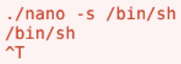

We navigate to the binary directory:


But when we try to execute with `^T` and enter `/bin/sh`, it doesn’t work.  
So we need another approach.

An alternative is to edit `/etc/passwd` and modify the root line by removing the password.

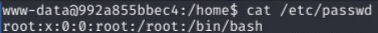

Now we edit it and delete the `x`, which represents the password field in `/etc/passwd`.  
With this, we can switch to the root user without a password.

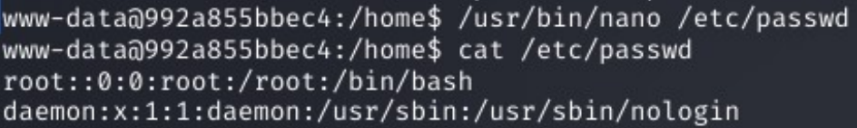

We run `su root`:


And with this, we complete the resolution of the “Domain” machine.

**Note:**  
This technique works because nano has the SUID bit set to root.  
This gives the binary an **EUID=0** when executed, which allows it to write to root-owned files such as `/etc/passwd`, even if you are `www-data`.  
Without SUID, saving the file would not be possible.
