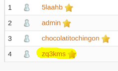
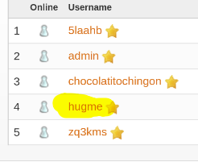
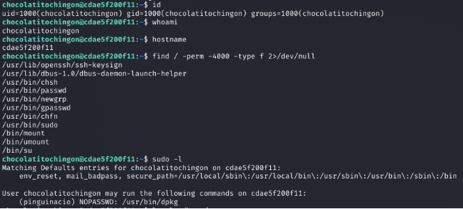
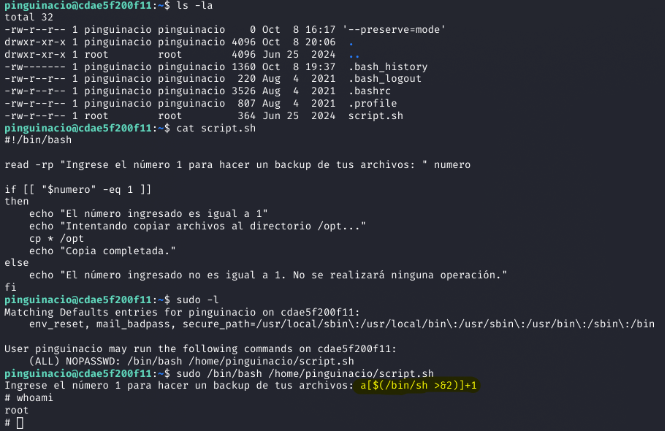

## 1. Información

En esta máquina **ChocolateFire** vamos a practicar un flujo realista de pentesting web y post-explotación centrado en **Openfire**.  
El objetivo es recorrer todas las etapas: reconocimiento de red y servicios, enumeración web, fuerza bruta de credenciales, bypass/explotación del panel de administración y finalmente el uso de frameworks para facilitar la explotación.

---

## 2. Reconocimiento con nmap

Una vez desplegado el contenedor Docker de la máquina, procedemos a realizar reconocimiento con `nmap`. Antes que nada, podemos comprobar conectividad con `ping` y luego lanzar un escaneo completo:


```bash
sudo nmap -sS -sV -Pn -T4 -p- --open -oA chocolatefire 172.17.0.2
```


En el resultado observamos que corre un servicio en el puerto **9090**, por lo que procedemos a investigar ese servicio (panel web).

---

## 3. Fingerprinting Web (Reconocimiento Web)

Abrimos el panel en el navegador y encontramos un **login panel de Openfire** (versión `4.7.4`). 


Con la versión identificada, podemos:

- Buscar exploits públicos o PoCs.  
- Probar credenciales por defecto conocidas para esa versión.

> **Nota 1:** Openfire es un servidor de mensajería XMPP (Jabber).  
> **Nota 2:** En este write-up realizamos dos vectores: prueba de credenciales por defecto y explotación mediante CVE.

Como se ve en la interfaz, las credenciales por defecto detectadas son `admin:admin`. Con eso intentamos el acceso primero y, en paralelo, preparamos la explotación.

### Exploits / referencias
- CVE-2023-32315 (explotación sobre ciertas versiones de Openfire).  
  Repositorios con PoC / exploit:  
  - https://github.com/miko550/CVE-2023-32315#  
  - https://github.com/K3ysTr0K3R/CVE-2023-32315-EXPLOIT

(En los repositorios enlazados hay variantes del exploit — las podemos denominar *Exploit A* y *Exploit B* según la fuente y metodología.)

Exploit A




Exploit B




---

## 4. Acceso inicial y fuerza bruta con Hydra

Tras enumerar usuarios desde el panel o con técnicas de enumeración, probamos el acceso por SSH con algunos de los primeros usuarios identificados. Si la credencial por defecto no fue suficiente o queremos probar otras cuentas, usamos `hydra` para fuerza bruta SSH.

Ejemplo (ataque contra usuario `chocatitochingon`):

```bash
hydra -l chocatitochingon -P /usr/share/wordlists/rockyou.txt 172.17.0.2 ssh -t 4
```


(Adaptá el comando según el usuario y la wordlist que quieras usar.)

Una vez que obtenemos credenciales válidas, nos conectamos por SSH:

```bash
ssh chocatitochingon@172.17.0.2
```

---

## 5. Escalada de privilegios (dos formas)

En esta máquina se muestran **dos vías** para escalar privilegios. Primero veremos la forma "más difícil" (para practicar consola y enumeración), y luego una forma rápida usando frameworks (por ejemplo Metasploit).

### 5.1. Escalada mediante abuso de binario (`dpkg`) — pivoting entre usuarios

Después de conectarnos por SSH con el usuario obtenido, realizamos la **enumeración interna** típica (`ls`, `id`, `sudo -l`, revisión de archivos en /home, etc.). Observamos que hay dos usuarios con directorios home; uno de ellos es `pinguinacio`.





Al comprobar permisos y `sudo -l`, vemos que `pinguinacio` tiene la posibilidad de ejecutar un binario o comando que permite escapar a una shell (en este caso `/usr/bin/dpkg` o comportamiento similar). Esto nos permite pivotar de `chocatitochingon` a `pinguinacio` mediante la ejecución controlada del binario.


Interacción ilustrativa:


```text
# Ejecutamos dpkg (o el binario señalado)
$ /usr/bin/dpkg
# Aparece el menú de ayuda / prompt; escapamos con:
!/bin/bash
# Con esto obtenemos una shell con el contexto de pinguinacio
```

Si ahora actuamos como `pinguinacio`, continuamos la enumeración y buscamos vectores de escalado.

Al listar el directorio encontramos un `script.sh` que `pinguinacio` puede leer:

```bash
ls -la
cat script.sh
```

Volvemos a comprobar `sudo -l` para `pinguinacio` y descubrimos que puede ejecutar como root el `script.sh`:

```bash
sudo -l
# muestra: (root) NOPASSWD: /ruta/a/script.sh
```

#### Vulnerabilidad en el script

La vulnerabilidad del script consiste en que la shell realiza **expansión de comandos** (`$(...)`) al evaluar una entrada (`read`), y esa expansión se realiza antes de la evaluación condicional. Aunque la comparación aritmética use comillas en `"$numero"`, la sustitución `$(/bin/sh)` ocurre en la fase de expansión de la shell y por tanto se ejecuta con los privilegios del proceso padre (que es **root** cuando corremos `sudo` sobre el script).

- **Resumen:** entrada no validada + ejecución del script como root → posibilidad de ejecutar `$(...)` como root.




> Referencia sobre la técnica: https://exploit-notes.hdks.org/exploit/linux/privilege-escalation/bash-eq/

Con esto, podemos inyectar una expansión que ejecute una shell como root, por ejemplo:

```text
# (hipotético) al introducir una entrada que ejecute la expansión:
$(/bin/sh)
# y obtener shell raíz
```

> **Advertencia:** el ejemplo anterior ilustra el mecanismo; en un entorno real hay que validar contexto y evitar ejecutar esto contra sistemas sin autorización.

### 5.2. Método “muy fácil” — usar Metasploit

Como alternativa rápida para fines de práctica, se puede utilizar Metasploit o herramientas que automatizan la explotación de la vulnerabilidad para obtener una sesión privilegiada más rápido. Esto es útil para aprendizaje o para comparar ambas metodologías (manual vs. framework).


---

## 6. Conclusión

Con los pasos anteriores comprometimos la máquina **ChocolateFire**: primero accediendo al panel Openfire (creds por defecto / exploit), luego obteniendo una cuenta con acceso remoto (SSH) y finalmente escalando privilegios mediante abuso de un script ejecutado por root y/o un binario con privilegios que permite pivotar a otro usuario con mayores permisos.

Como se vio, hay varias formas de escalar privilegios: desde el análisis y explotación manual (recomendado para aprendizaje y comprensión) hasta el uso de frameworks que aceleran el proceso. Practicar ambas aproximaciones fortalece la habilidad para identificar vectores y proponer remediaciones.

---

## Recursos y enlaces

- CVE / exploits Openfire:  
  - https://github.com/miko550/CVE-2023-32315#  
  - https://github.com/K3ysTr0K3R/CVE-2023-32315-EXPLOIT

- Técnica de expansión de shell en `read` / `bash -eq`:  
  - https://exploit-notes.hdks.org/exploit/linux/privilege-escalation/bash-eq/