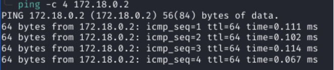
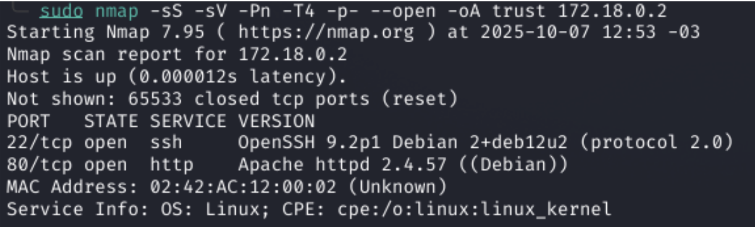
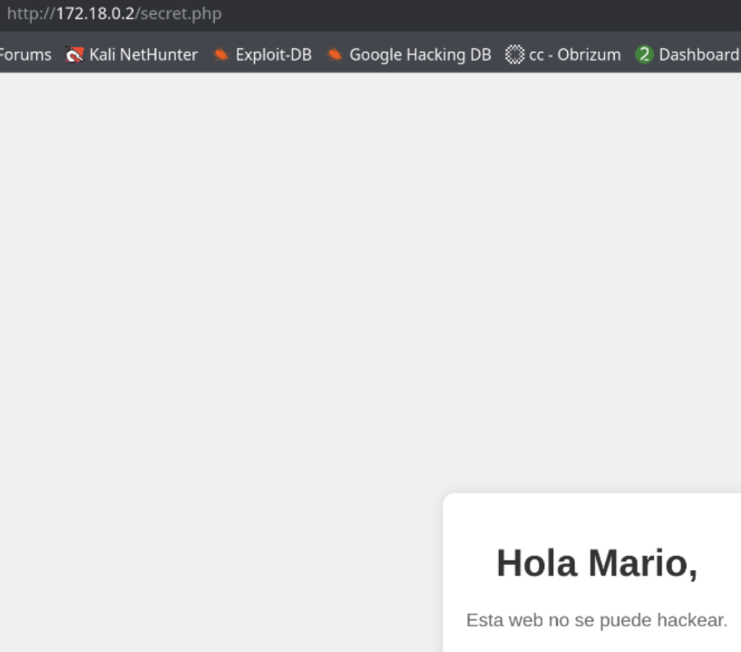
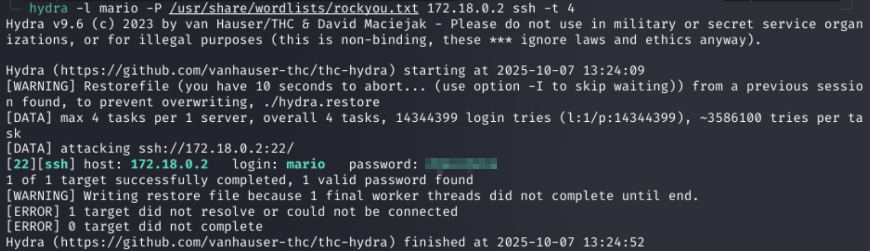
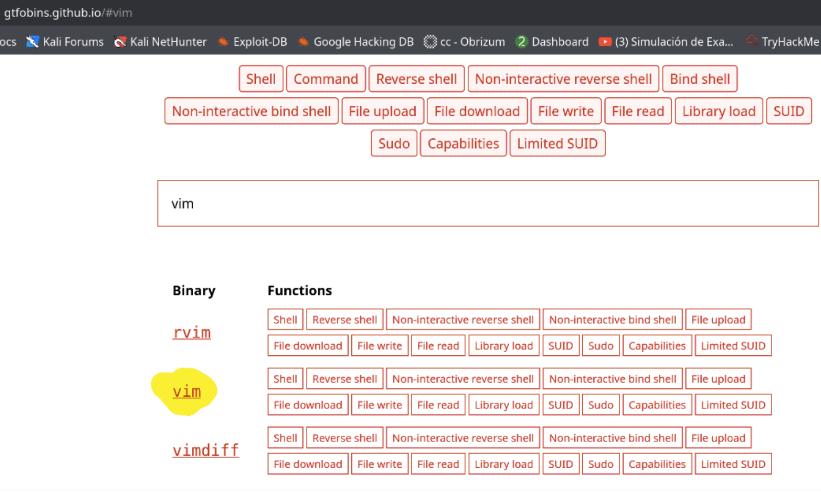
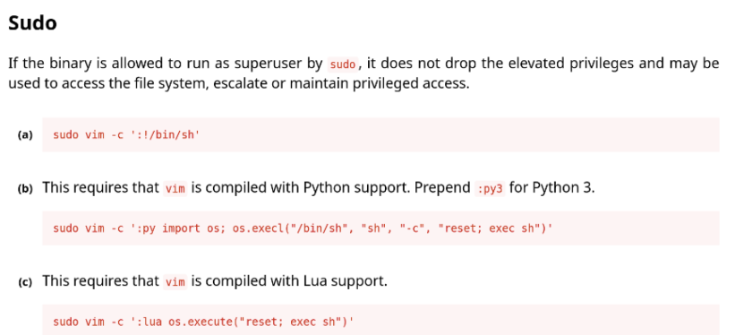
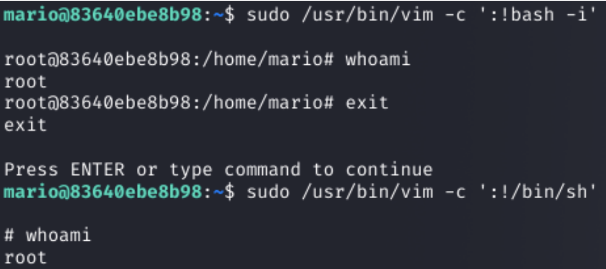

## Información
La máquina *Trust* te permite practicar reconocimiento de servicios, fuzzing de directorios, ataques de fuerza bruta con Hydra y escalada de privilegios aprovechando binarios con permisos elevados (en este caso, `vim`).

## Reconocimiento con nmap
Una vez desplegado el docker de la maquina, procedemos a realizar un reconocimiento con nmap, pero antes que nada, realizamos un ping para comprobar conectividad con la maquina victima.

```bash
ping -c 4 172.18.0.2
```




```bash
sudo nmap -sS -sV -Pn -T4 -p- --open -oA trust 172.18.0.2
```


Como podemos observar, tenemos dos puertos abiertos, 22 de ssh y 80 donde corre un apache, indicio de una pagina web.

## Fingerprinting Web (Reconocimiento Web)
Empezamos por hacer un reconocimiento web, abrimos la pagina en nuestro navegador para ver que nos encontramos:


No hay nada interesante, pero debemos tener en cuenta que dentro del directorio /var/www/html/ pueden haber otras paginas alojadas, por lo cual debemos hacer un fuzzing web de directorios.

```bash 
gobuster dir -u http://172.18.0.2/ -w /usr/share/wordlists/dirbuster/directory-list-2.3-medium.txt -x php,txt,zip,bak,sql -t 40 -o gobuster.txt
```


Y con esto, nos encuentra un directorio llamado “secret.php” en cual vamos a proceder a investigar. 

Una vez abierto la pagina, solo nos aparece esto:



Ya tenemos al menos una pista, un posible nombre de usuario que podemos utilizar!!

## Fuerza bruta con Hydra y escalada de privilegios.

Como habíamos visto anteriormente teníamos un nombre, que puede ser un nombre de usuario, el nombre es Mario, hay que saber que puede ser Mario o mario, entonces, con esta pista realizamos un ataque de fuerza bruta con Hydra.

```bash
hydra -l mario -P /usr/share/wordlists/rockyou.txt 172.18.0.2 ssh -t 4
```



uego echo el ataque, ya descubrimos la contraseña, acto seguido, veamos si podemos tomar control de la maquina. 

Nos conectamos a la maquina.

```bash
ssh mario@172.18.02
```


Una vez conectados, empezamos la etapa de enumeración interna.


Bueno, realizando esta enumeración, encontramos que el usuario mario puede usar vim como root, con este binario podemos escalar privilegios, primero vamos a dirigirnos a una pagina que se llama gtfobins y buscamos el binario vim.

Nota: GTFOBins es un repositorio comunitario (web + GitHub) que lista binarios UNIX que pueden ser abusados para escapar de restricciones, ejecutar comandos con privilegios, leer/escribir archivos, establecer conexiones de red, etc.
Cada entrada muestra técnicas categorizadas (por ejemplo: cómo usar ese binario si es SUID, si lo podés ejecutar con sudo, si permite escribir archivos, abrir shells, ejecutar comandos remotos, etc.).

https://gtfobins.github.io/gtfobins/vim/




Ingresamos dentro de vim, y podemos encontrar como escalar privilegios, en este ejemplo tenemos como hacerlo con sudo.



```bash
sudo /usr/bin/vim -c ':!bash -i'
```



Con esto terminamos la resolución de la maquina “Trust” de dockerlabs.

