## Información

En esta máquina “Domain” vamos a practicar un flujo realista de
pentesting web y post-explotación centrado en Samba. El objetivo es
recorrer todas las etapas: reconocimiento de red y servicios,
enumeración web, fuerza bruta de credenciales, bypass/explotación
de samba y finalmente abuso de subida de archivos y escala de
privilegios desde binario con SUID.

## Reconocimiento con nmap
Una vez desplegado el docker de la maquina, procedemos a realizar
un reconocimiento con nmap, pero antes que nada, realizamos un ping
para comprobar conectividad con la maquina victima.

```bash
sudo nmap -sS -sV -Pn -T4 -p- --open -oA domain 172.17.0.2
```


Vemos que corre tres servicios, uno de ellos es el puerto 80. Asi
que procedemos a investigar si tiene alguna pagina web.

## Fingerprinting Web (Reconocimiento Web)
Empezamos por hacer un reconocimiento web, abrimos la pagina en
nuestro navegador para ver que nos encontramos:

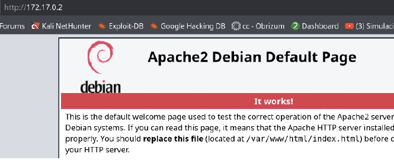

Nos encontramos con la pagina de apache, vamos a realizar un
fuzzing de directorios para ver que nos encontramos.

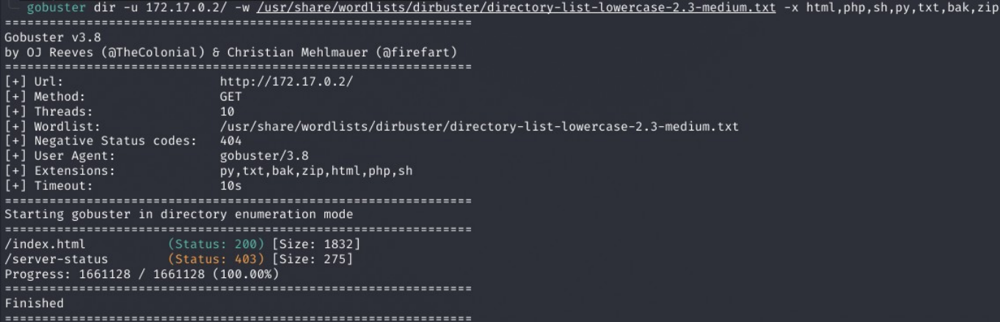

Solamente nos encontramos con un index.html, vamos a investigarlo.


En esta pagina no encontramos nada raro, así que vamos analizar los
puertos 139 y 445.

### Auditoria SMB y reverse shell
En esta etapa podemos usar las herramientas nxc, enum4linux y
smbclient.
Primero hacemos la demostración con nxc, en este caso si el samba
esta mal configurado permite null session, te lista shares y
usuarios; si no, va a fallar.


Nos encontro dos usuarios, ahora vamos a probar conectandonos con
smbclient

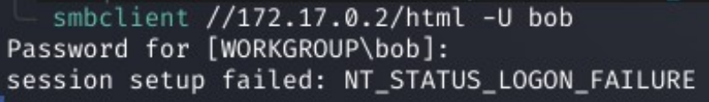

Como vemos, nos pide contraseña, así que vamos a proceder
realizando un ataque de fuerza bruta por diccionario con nxc.

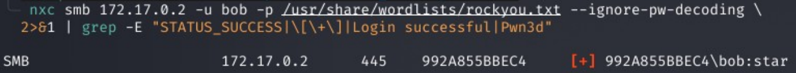

Pudimos descubrir la contraseña de bob, ahora nos conectamos
nuevamente al recurso html.

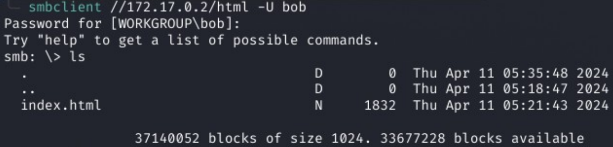

Podemos ver que solamente existe el index.html que fue el que
encontramos previamente con gobuster, lo que podemos hacer ahora es
probar si podemos subir un test.php y si se sube y ejecuta,
probamos que apache interpreta php.


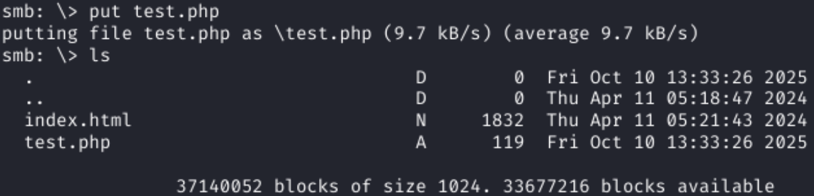

NOTA: A veces .php NO está mapeado pero .phtml sí (config de
Apache), entonces creamos el mismo archivo pero con
extensión .phtml

Comprobamos nuestro archivo:

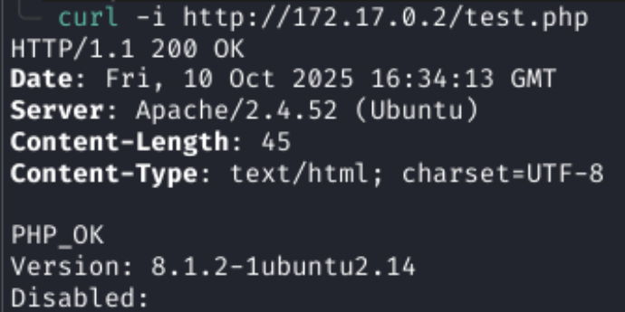


Una vez comprobado esto, vamos a subir una reverse shell, nos
dirigimos a la pagina https://www.revshells.com/ la cual es una
reverse shell generator.
Vamos a seleccionar nuestra ip atacante, el puerto donde
escucharemos y también nos crea un listener, elegimos php y
elegimos al siempre confiable “PentestMonkey”.


Copiamos la reverse shell en un archivo .php y lo subimos tal cual
hicimos con el test.php
Luego, abrimos un listener para que cuando ejecutemos la pagina
/reverse.php podamos crear la conexión y tomar control de la
maquina victima.


Vamos al navegador y le          
damos enter ->          

Y en nuestro listener obtenemos la reverse shell.

 

## Escalada de privilegios
Ahora vamos a realizar unos pasos para estabilizar
nuestra reverse shell.

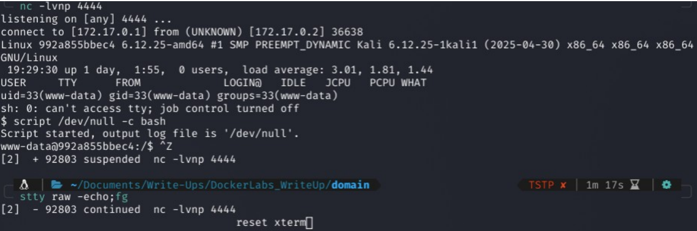
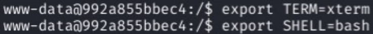

Una vez estabilizada la reverse shell, hacemos la típica
búsqueda de información.

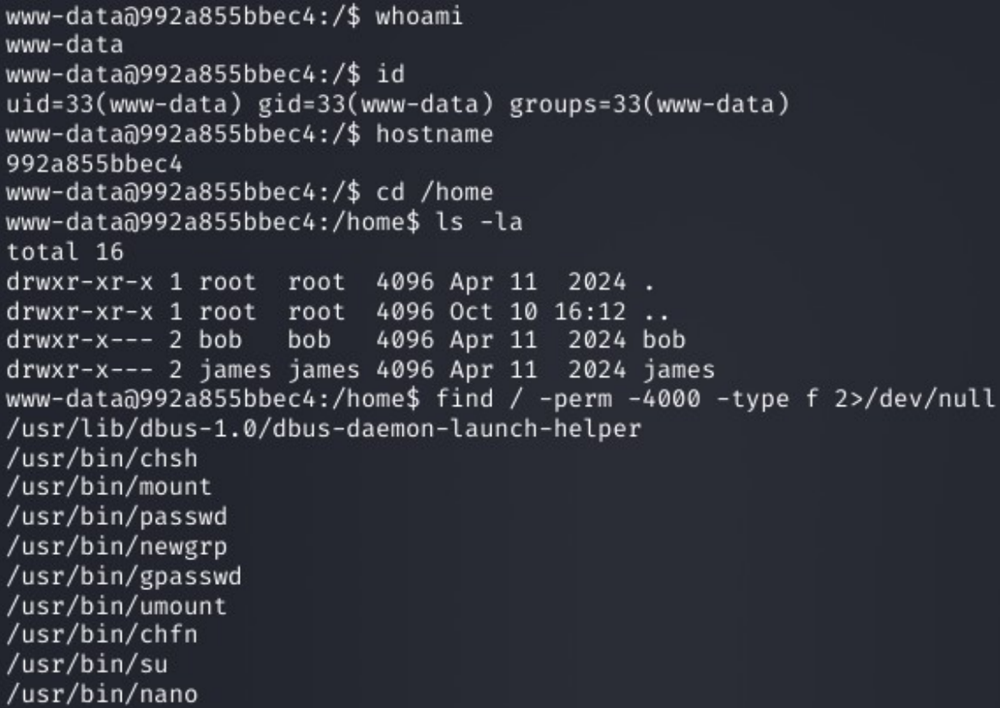

Descubrimos que el binario nano tiene SUID activado, por
lo tanto podemos usar
https://gtfobins.github.io/gtfobins/nano/ y realizar una
elevación de privilegios.


Nos vamos a la carpeta del binario:

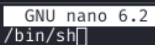

Pero cuando intentamos ejecutar con ^T y ponemos /bin/sh
no nos deja. Así que tendremos que buscar otra
alternativa.

Otra alternativa es editar el archivo /etc/passwd, la
linea de root, le vamos a eliminar la contraseña


ahora lo editamos, y le borramos la x, la cual representa
la contraseña en /etc/passwd, con esto vamos a poder
cambiarnos al usuario root sin contraseña.


Ejecutamos “su root”

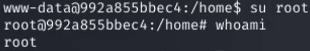


y con esto terminamos la resolución de la maquina Domain.
Nota: Esta técnica funciona porque nano tiene el bit SUID en root.
Eso le da EUID=0 a nano al ejecutarse, así que puede escribir
archivos de root como /etc/passwd aunque vos seas www-data. Sin
SUID, no podrías guardar.